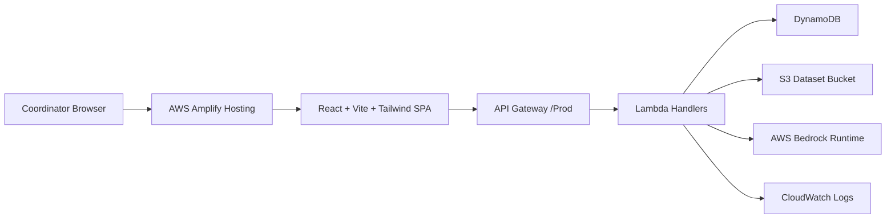
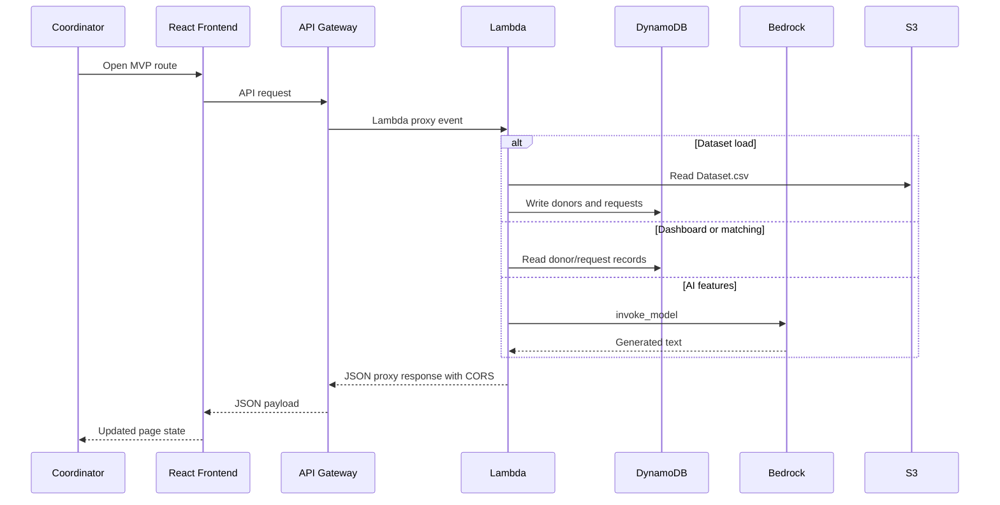
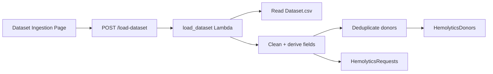
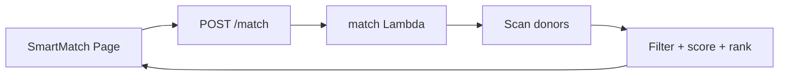
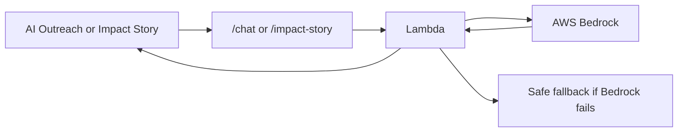

# Hemolytics Architecture

## Architecture Summary

Hemolytics is split into a static React frontend and an AWS serverless backend. The frontend is deployed through AWS Amplify Hosting. The backend is deployed separately with AWS SAM and exposes API Gateway routes backed by Lambda functions.



## Runtime Flow



## Frontend Layers

```text
src/App.tsx
  -> src/components/Layout.tsx
  -> src/pages/*
  -> src/services/api.ts
  -> src/config/apiConfig.ts
  -> src/utils/* for mock/local behavior
```

The frontend uses a single app shell. Desktop uses a fixed expanded sidebar. Mobile uses a top header and drawer. The app switches between AWS Connected Mode and Mock Mode based on `VITE_API_BASE_URL`.

## Backend Layers

```text
API Gateway
  -> Lambda handler in backend/handlers/
  -> shared service in backend/services/
  -> DynamoDB, S3, Bedrock, CloudWatch
```

The backend is intentionally thin at the handler layer. Shared behavior such as CORS, JSON parsing, DynamoDB conversion, Bedrock fallback, scoring, and response classification lives in services.

## AWS Resources

Defined in `backend/template.yaml`:

- `AWS::Serverless::Api` for API Gateway
- 7 `AWS::Serverless::Function` Lambda functions
- 4 `AWS::DynamoDB::Table` resources
- 1 `AWS::S3::Bucket` for dataset storage
- Shared IAM role for Lambda

## IAM Design

The SAM template creates a shared Lambda role with:

- `AWSLambdaBasicExecutionRole`
- DynamoDB read/write permissions for the four Hemolytics tables
- S3 list/get/put permissions for the dataset bucket
- Bedrock `InvokeModel` permission for Anthropic Claude models in `us-east-1`

This is a pragmatic hackathon role. A production hardening pass should split permissions by function.

## Data Flow by Feature

Dataset ingestion:



SmartMatch:



AI features:



## Deployment Architecture

Frontend:

- GitHub repository connected to AWS Amplify
- `amplify.yml` runs `npm install` and `npm run build`
- Build output: `dist`
- Runtime API URL is supplied through Amplify environment variable `VITE_API_BASE_URL`

Backend:

- Deployed separately with SAM
- `backend/scripts/deploy_sam.sh` runs Python compile checks, SAM build, and SAM deploy
- API URL is returned as a SAM output

## Architecture Decisions

- DynamoDB is used as the primary database to keep the MVP serverless and low operational overhead.
- API Gateway plus Lambda avoids a persistent backend server.
- Bedrock is used through AWS-native IAM rather than direct third-party API keys.
- Frontend mock mode lets the app remain demoable without AWS configuration.
- Dashboard uses sampled scans to prevent live demo timeouts on a real dataset.

## Not Applicable

- No PostgreSQL/RDS architecture
- No Redis cache
- No container runtime
- No queue or event bus
- No production WhatsApp integration
- No SageMaker training pipeline
- No direct Anthropic/OpenAI service path

