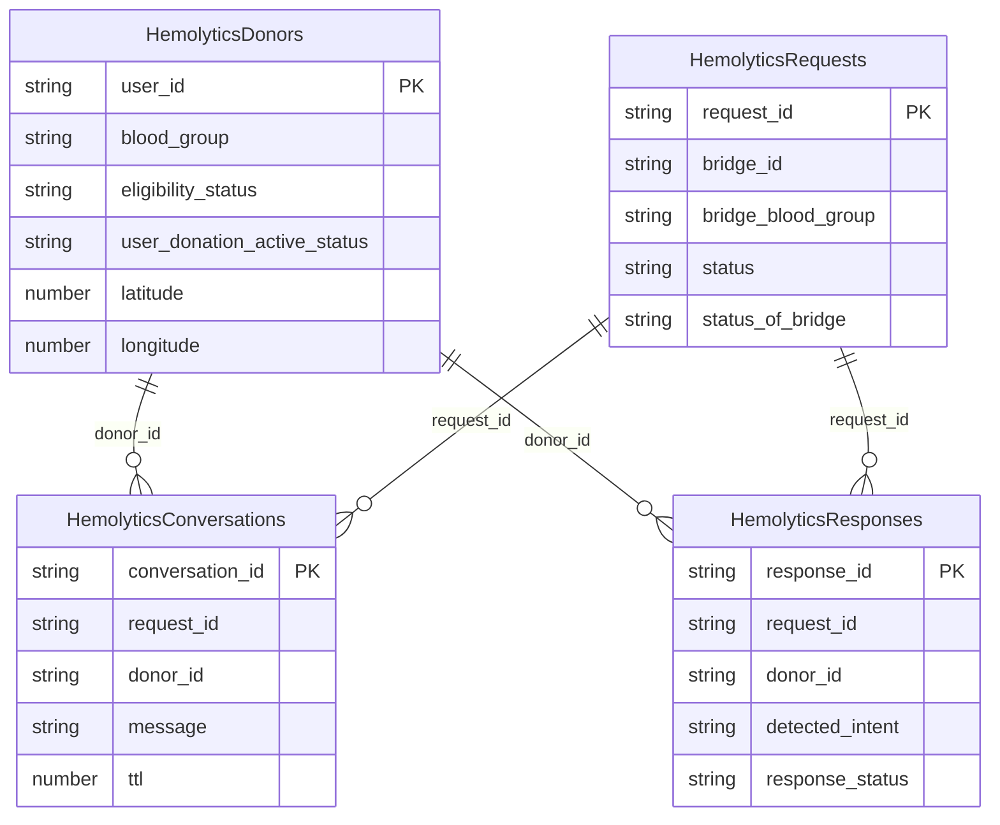

# Hemolytics Database Documentation

## Database Overview

Hemolytics uses Amazon DynamoDB as its primary database. Tables are defined in `backend/template.yaml` and accessed through `backend/services/dynamodb_service.py`.

Billing mode:

```text
PAY_PER_REQUEST
```

Region:

```text
us-east-1
```

## Tables

| Table | Partition key | Purpose |
| --- | --- | --- |
| `HemolyticsDonors` | `user_id` | Deduplicated donor profiles |
| `HemolyticsRequests` | `request_id` | Bridge/request candidate records |
| `HemolyticsConversations` | `conversation_id` | AI outreach conversation records |
| `HemolyticsResponses` | `response_id` | Donor response classification and escalation records |

## Logical Relationships



DynamoDB does not enforce these relationships. They are application-level references.

## HemolyticsDonors

Primary key:

```text
user_id
```

Source:

- S3 `Dataset.csv`
- Optional request body `rows` array for local/test ingestion

Raw dataset fields handled by `dataset_service.py`:

- `user_id`
- `bridge_id`
- `role`
- `role_status`
- `bridge_status`
- `blood_group`
- `gender`
- `latitude`
- `longitude`
- `bridge_gender`
- `bridge_blood_group`
- `quantity_required`
- `last_transfusion_date`
- `expected_next_transfusion_date`
- `registration_date`
- `donor_type`
- `last_contacted_date`
- `last_donation_date`
- `next_eligible_date`
- `donations_till_date`
- `eligibility_status`
- `cycle_of_donations`
- `total_calls`
- `frequency_in_days`
- `status_of_bridge`
- `status`
- `donated_earlier`
- `last_bridge_donation_date`
- `calls_to_donations_ratio`
- `user_donation_active_status`
- `inactive_trigger_comment`

Derived fields:

- `has_valid_blood_group`
- `has_valid_location`
- `is_match_eligible`
- `donor_experience_score`
- `engagement_score`
- `eligibility_score`
- `location_quality_score`
- `reengagement_priority`
- `bridge_request_candidate`

Deduplication:

Donor records are deduplicated by `user_id` before writing to `HemolyticsDonors`. The most complete row is kept using:

1. Valid/non-empty blood group that is not `Do not Know`
2. Valid latitude and longitude
3. Existing eligibility status
4. Existing active status
5. Higher donations count
6. Higher total calls
7. More recent donation/contact date
8. First valid row fallback

## HemolyticsRequests

Primary key:

```text
request_id
```

Source:

- Dataset rows where `bridge_request_candidate` is true

Request IDs are generated safely when missing:

```text
REQ-<bridge_id>-<row_index>
REQ-<user_id>-<row_index>
```

This prevents duplicate keys in DynamoDB batch writes.

Common fields:

- `request_id`
- `bridge_id`
- `user_id`
- `bridge_status`
- `status_of_bridge`
- `bridge_blood_group`
- `quantity_required`
- `expected_next_transfusion_date`
- `status`
- `created_at`
- `updated_at`

## HemolyticsConversations

Primary key:

```text
conversation_id
```

TTL attribute:

```text
ttl
```

Source:

- `/chat` handler after outreach message generation

Common fields:

- `conversation_id`
- `request_id`
- `donor_id`
- `message`
- `model`
- `provider`
- `safety_notice`
- `bedrock_available`
- `fallback_used`
- `created_at`
- `ttl`

## HemolyticsResponses

Primary key:

```text
response_id
```

Source:

- `/response` handler

Common fields:

- `response_id`
- `request_id`
- `donor_id`
- `response_text`
- `detected_intent`
- `response_status`
- `ai_summary`
- `next_action`
- `escalation_triggered`
- `next_donor_id`
- `updated_request_status`
- `created_at`

The response service also attempts to update the related `HemolyticsRequests` record with request status and `last_response_id`.

## DynamoDB Service Helpers

Implemented in `backend/services/dynamodb_service.py`:

- `get_table(table_name)`
- `scan_all(table_name, limit=None)`
- `scan_limited(table_name, limit=1000, projection_expression=None, expression_attribute_names=None)`
- `put_item(table_name, item)`
- `get_item(table_name, key)`
- `update_item(table_name, key, update_expression, expression_values, expression_names=None)`
- `batch_write_items(table_name, items, key_name=None)`
- `safe_dynamodb_item(item)`

Important conversion behavior:

- DynamoDB cannot store Python `float` values directly.
- Floats are converted to `Decimal` before writes.
- `Decimal` values are converted back to JSON-safe `int` or `float` before returning responses.

## Access Patterns

Current access patterns:

- Dashboard: limited scan with projection fields
- Dataset ingestion: batch writes to donor and request tables
- SmartMatch: donor scan and in-memory ranking
- Chat: write one conversation record
- Response: write one response record and update one request

No secondary indexes are defined in the current SAM template.

## Known Database Limitations

- No DynamoDB GSIs are implemented.
- SmartMatch is scan-based, which is acceptable for the hackathon dataset but not ideal for large production scale.
- No point-in-time recovery configuration was observed in the SAM template.
- No stream processing or background aggregation exists.
- No relational constraints or migrations apply because DynamoDB is used.

## Not Applicable

- SQL schema migrations
- Foreign key constraints
- ORM model definitions
- Redis cache keys
- PostgreSQL indexing strategy
- RDS backup configuration

