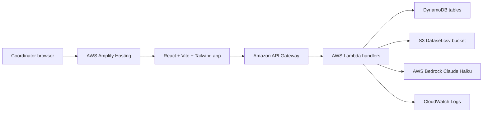

# Hemolytics Technical Documentation

## 1. Project Overview

Hemolytics is an AI-assisted blood donation coordination MVP for Blood Warriors and the AI for Good Hackathon. The application helps coordinators load a donor/request dataset, view fast analytics, prioritize donors, generate safe outreach copy, classify responses, handle escalation, and generate anonymized awareness content.

Safety boundary: Hemolytics does not certify donor health, donor eligibility, or blood safety. It assists coordination only. Final decisions remain with authorized human coordinators and medical staff.

Live frontend:

```text
https://main.d2sj4v5ffjc9ah.amplifyapp.com
```

Live backend API:

```text
https://w1nxgpj5ng.execute-api.us-east-1.amazonaws.com/Prod
```

## 2. Technology Stack

Frontend:

- React 18
- Vite
- TypeScript source files
- Tailwind CSS
- React Router
- Zustand
- Lucide React icons
- AWS Amplify Hosting through `amplify.yml`

Backend:

- AWS SAM
- Amazon API Gateway
- AWS Lambda using Python 3.11
- Amazon DynamoDB
- Amazon S3 for `Dataset.csv`
- AWS Bedrock Runtime through `boto3`
- Amazon CloudWatch Logs

Not used:

- PostgreSQL/RDS as primary storage
- Redis
- FastAPI as primary backend
- App Runner as default runtime
- Docker/ECR as a mandatory deployment path
- Direct Anthropic API
- Direct OpenAI API
- Production WhatsApp API
- SageMaker pipeline
- Full community platform

## 3. Repository Structure

```text
.
|-- src/
|   |-- components/
|   |-- config/
|   |-- data/
|   |-- pages/
|   |-- services/
|   |-- store/
|   |-- utils/
|   |-- App.tsx
|   |-- main.tsx
|   `-- index.css
|-- backend/
|   |-- handlers/
|   |-- services/
|   |-- events/
|   |-- scripts/
|   |-- template.yaml
|   |-- samconfig.toml
|   |-- env.example
|   |-- requirements.txt
|   `-- README.md
|-- docs/
|-- amplify.yml
|-- package.json
|-- tailwind.config.js
|-- postcss.config.js
`-- README.md
```

## 4. System Architecture



The frontend is deployed independently from the backend. Amplify hosts the static React app. The backend is deployed separately with SAM and exposes an API Gateway base URL. The frontend chooses AWS mode when `VITE_API_BASE_URL` is set.

## 5. Frontend Architecture

Entry points:

- `src/main.tsx` renders `App`.
- `src/App.tsx` configures routes with `BrowserRouter`.
- `src/components/Layout.tsx` provides the app shell, desktop sidebar, mobile drawer, safety banner, and step flow.

Routes:

- `/` - landing page
- `/dashboard` - dashboard analytics
- `/dataset-ingestion` - dataset reload page
- `/dataset` - redirects to `/dataset-ingestion`
- `/smartmatch` - donor ranking
- `/ai-outreach` - coordinator outreach copy generation
- `/outreach` - redirects to `/ai-outreach`
- `/response-tracking` - response classification and escalation
- `/responses` - redirects to `/response-tracking`
- `/impact-story` - awareness content generation
- `/impact` - redirects to `/impact-story`
- `/api-settings` - AWS/API visibility

API client:

- `src/config/apiConfig.ts` reads `VITE_API_BASE_URL`.
- `src/services/api.ts` calls AWS endpoints when connected.
- If `VITE_API_BASE_URL` is absent, the frontend uses mock data and local utility functions.

## 6. Backend Architecture

The backend uses Lambda proxy-style handlers:

- `backend/handlers/health.py`
- `backend/handlers/dashboard.py`
- `backend/handlers/load_dataset.py`
- `backend/handlers/match.py`
- `backend/handlers/chat.py`
- `backend/handlers/response.py`
- `backend/handlers/impact_story.py`

Shared services:

- `common.py` - CORS responses, body parsing, env helpers, JSON-safe conversion
- `dynamodb_service.py` - DynamoDB table access and safe writes
- `dataset_service.py` - CSV/S3 loading, normalization, derived fields, deduplication
- `scoring_service.py` - SmartMatch distance and ranking logic
- `bedrock_service.py` - Bedrock Claude invocation and safe fallbacks
- `response_service.py` - intent classification and escalation logic

All handlers return API Gateway Lambda proxy responses with JSON body and CORS headers.

## 7. API Endpoints

| Method | Path | Purpose |
| --- | --- | --- |
| GET | `/health` | Health and architecture metadata |
| GET | `/dashboard` | Sampled dashboard metrics |
| POST | `/load-dataset` | Load S3 or provided rows into DynamoDB |
| POST | `/match` | Rank top donors for coordinator review |
| POST | `/chat` | Generate safe donor outreach copy |
| POST | `/response` | Classify response and update escalation state |
| POST | `/impact-story` | Generate anonymized awareness content |

All routes are configured in `backend/template.yaml`.

## 8. Data Model

DynamoDB tables:

- `HemolyticsDonors`, partition key `user_id`
- `HemolyticsRequests`, partition key `request_id`
- `HemolyticsConversations`, partition key `conversation_id`, TTL attribute `ttl`
- `HemolyticsResponses`, partition key `response_id`

Relationships are logical and application-managed. DynamoDB does not enforce foreign keys.

## 9. Dataset Ingestion

`backend/services/dataset_service.py` supports:

- Loading `Dataset.csv` from S3 using `S3_DATASET_BUCKET` and `S3_DATASET_KEY`
- Loading request-provided rows through a `rows` array
- Cleaning dataset fields
- Deriving scoring fields
- Deduplicating donors by `user_id`
- Creating request records with unique `request_id`
- Writing donors and requests to DynamoDB

Deduplication keeps the most complete donor profile per `user_id` using blood group, location, eligibility, active status, donation count, call count, recency, and first-row fallback.

Latest documented dataset load stats:

- 7,033 rows loaded
- 6,946 unique users
- 786 request records
- 87 duplicate user groups handled
- 2,036 invalid/unknown blood groups flagged
- 24 missing locations flagged

## 10. SmartMatch Logic

`backend/services/scoring_service.py` ranks donors with:

- Exact blood group match
- `eligibility_status == "eligible"`
- `user_donation_active_status == "Active"`
- Valid latitude/longitude
- Haversine distance
- Proximity, engagement, experience, eligibility, and location quality scores

Weights:

- Proximity: 0.30
- Engagement: 0.25
- Experience: 0.15
- Eligibility: 0.15
- Location quality: 0.15

Fallback behavior allows active-status relaxation only for backup candidates that are still eligible and have valid blood group/location. The code does not include not-eligible donors in urgent recommendations.

## 11. AI and Bedrock Integration

`backend/services/bedrock_service.py` uses `boto3.client("bedrock-runtime")` and `invoke_model`.

Configured model defaults in the SAM backend:

```text
anthropic.claude-3-5-haiku-20241022-v1:0
```

The service sends Claude messages using the Bedrock Anthropic body format:

```json
{
  "anthropic_version": "bedrock-2023-05-31",
  "max_tokens": 300,
  "temperature": 0.7,
  "system": "...",
  "messages": [
    { "role": "user", "content": "..." }
  ]
}
```

If Bedrock fails, the backend returns safe fallback text with:

```json
{
  "bedrock_available": false,
  "fallback_used": true,
  "bedrock_error_type": "ExceptionClassWhenAvailable"
}
```

CloudWatch logging includes safe error context, model ID, region, operation, and fallback status. Prompts, PII, AWS credentials, and secrets are not logged.

## 12. Response Tracking

`backend/services/response_service.py` classifies responses by keywords:

- `confirm` - yes, available, I can come, ok, sure, confirmed
- `decline` - no, not possible, unavailable, cannot, can't
- `reschedule` - later, tomorrow, after, evening, another time
- `no_response` - empty, timeout, no response

Status mapping:

- confirm -> `donor_confirmed`
- decline -> escalation to next donor
- no response -> escalation to next donor
- reschedule -> `needs_follow_up`
- all donors failed -> `needs_coordinator_attention`

## 13. Security and Secrets

Current controls:

- AWS credentials are not stored in code.
- Runtime configuration uses environment variables.
- `.gitignore` excludes `.env*` while allowing `.env.example`.
- Dataset CSV and generated artifacts are ignored.
- Bedrock logs avoid prompts, PII, and secrets.
- AI safety instructions are embedded in backend prompts and fallback responses.

Known gaps:

- There is no authentication or authorization layer in the current MVP.
- API Gateway CORS allows `*`.
- Frontend environment variables are public by nature and should only contain non-secret API URLs.
- No WAF, rate limiting, custom authorizer, or role-based access controls are implemented.

## 14. Observability

Implemented:

- Lambda logs through CloudWatch
- Safe Bedrock error logs
- API smoke test script at `backend/scripts/test_api_endpoints.py`
- Local handler runner at `backend/scripts/run_local_handler.py`

Not implemented:

- Structured centralized application metrics
- CloudWatch alarms
- X-Ray tracing
- Audit dashboards
- CI log aggregation

## 15. Performance Notes

Implemented performance protections:

- Dashboard uses limited DynamoDB scans with configurable limits.
- Dashboard returns `dashboardMode: "sampled"`.
- Top eligible donor preview is limited.
- DynamoDB tables use pay-per-request billing in SAM.

Potential bottlenecks:

- SmartMatch currently loads donors from DynamoDB and ranks in Lambda.
- No DynamoDB GSI optimization is implemented.
- No background job or queue is used for large dataset ingestion.
- Bedrock calls run synchronously inside Lambda.

## 16. Error Handling

Backend:

- Common JSON response helpers standardize success and error payloads.
- JSON body parsing raises controlled bad requests.
- Bedrock failures return safe fallbacks instead of failing user workflows.
- DynamoDB decimal conversion avoids JSON serialization errors.

Frontend:

- Pages display loading states and visible error panels.
- Mock mode keeps the app usable without a backend URL.
- Dataset, SmartMatch, Outreach, Response Tracking, and Impact Story pages catch API failures.

## 17. Build and Deployment

Frontend:

```bash
npm install
npm run build
```

Amplify uses `amplify.yml` and publishes `dist`.

Backend:

```bash
bash backend/scripts/deploy_sam.sh
```

Manual SAM alternative:

```bash
sam build --template-file backend/template.yaml
sam deploy --guided
```

## 18. Testing

Available:

- Frontend production build through `npm run build`
- Backend syntax check through `python -m compileall backend`
- API smoke test script against deployed API
- Local Lambda event runner
- Bedrock diagnostic script

Not present in the codebase:

- Unit test framework
- Frontend component tests
- Backend service unit tests
- End-to-end test suite
- CI pipeline

## 19. Known Limitations

- Authentication is not implemented.
- Role-based access is not implemented.
- Audit approval workflow is not implemented.
- Dashboard metrics are sampled for demo speed, not full analytical aggregation.
- SmartMatch ranking is synchronous and scan-based.
- Production WhatsApp sending is intentionally not implemented.
- `src/types/index.ts` appears to be incomplete or empty while several files import types from it. Vite production build can transpile without full type-checking, but a strict TypeScript check may expose gaps.
- Frontend `src/config/apiConfig.ts` contains a Bedrock model display constant that may not be the authoritative backend model. The SAM/backend environment is the authoritative source for deployed AI model selection.

## 20. Not Applicable Sections

Not applicable to this MVP:

- Relational schema migrations
- ORM documentation
- Docker image lifecycle
- Kubernetes/ECS deployment
- Redis cache invalidation
- Background worker queues
- Full WhatsApp Business API flow
- SageMaker model training or deployment
- Direct Anthropic/OpenAI API key management

